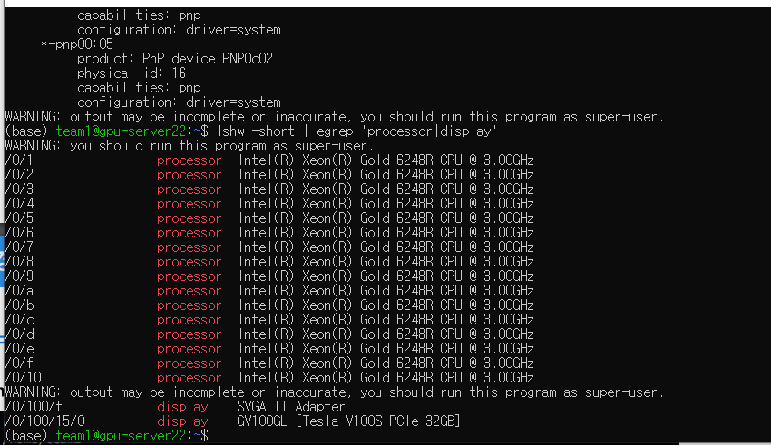
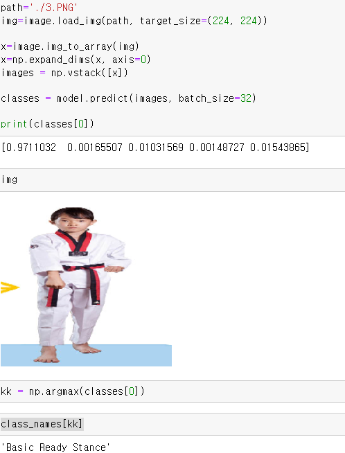

# 인공지능 학습 환경

### 하드웨어 정보

- 인텔 제온 골드 6248R
  - 24코어 48쓰레드  3.0Ghz

- GPU 정보
  - 

- CUDA toolkit

  

# 학습 시퀀스

1. 로컬 pc에서 ssafy제공 서버와 연결을 통해 조작.
2. 로컬 pc와 학습용 서버간의 데이터는 github를 통해 주고 받음
3. 서버에는 아나콘다 환경에서 jupyter notebook을 실행시켜 코딩을 함.