# 검은띠 휘날리며 - AI 설명서


[TOC]

## 1. 프로젝트 요구사항

### 	1. 기본동작

​		 기본준비서기, 몸통지르기 등 13가지 동작을 구분하기 위한 인공지능 모델

​		해당 자세만을 판단하는 개별 모델

### 	2. 연속동작/품새

​		1장~8장, 고려, 금강 등 품새별 4개의 구간으로 나눠서 해당 구간의 동작을 구분하는 인공지능 모델

### 	3. 겨루기

​		얼굴막기, 몸통지르기, 발차기 등의 동작을 구분하는 인공지능 모델

## 2. 프로젝트 기획

### 1. 모델 학습 직접 구현

1. 태권도 자세 데이터 직접 촬영
2. 데이터 전처리 (스켈레톤 그리기)
3. 알려진 모델들을 구현하여 학습
4. 학습셋과 테스트셋의 지표들을 이용하여 학습율 판단
5. 모델별로 학습율 비교
6. 캠을 통한 동작 촬영하여 검증

### 2. Teachable Machine으로 구현

1. 태권도 자세 데이터 직접 촬영
2. 데이터 전처리(잘 나온 데이터만을 추리는 작업)
3. 모델 변수 변경하며 학습
4. 동작을 촬영하여 학습된 모델 검증
5. 데이터 보강


1번 계획을 기본으로 진행하고 유의미한 결과값이 도출되지 않을 시 

2번 계획으로 넘어가는 것을 기본으로 진행함

## 3. 코딩을 통한 인공지능 모델 제작

### 1. 외부서버 환경설정

#### 하드웨어 정보

- 인텔 제온 골드 6248R
  - 24코어 48쓰레드  3.0Ghz

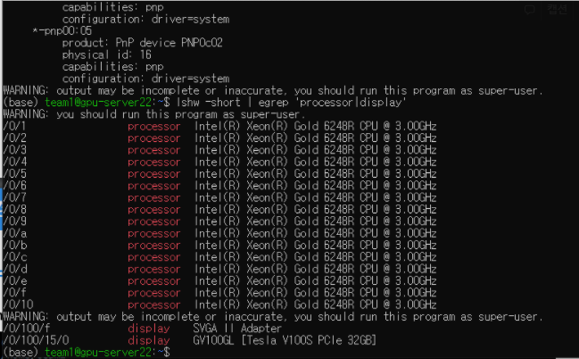

- GPU 정보

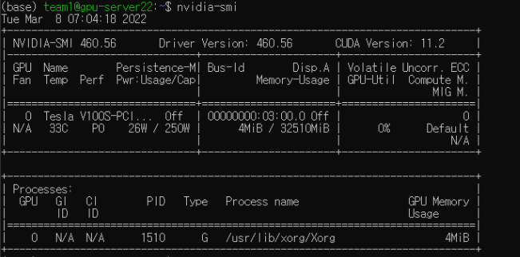

- CUDA toolkit

  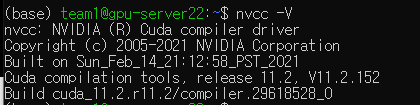

#### 외부환경 접근

1. 로컬 pc에서 ssafy제공 서버와 연결을 통해 조작.
2. 서버에는 아나콘다 환경에서 jupyter notebook을 실행시켜 코딩을 함.
3. 인터넷에 제공된


### 2. 인공지능 학습

#### 1. 인공지능 모델 조사(딥러닝 모델 종류)

##### 1.CNN (합성곱 신경망)

- 인간의 시신경 구조를 모방한 기술

- 특징

  - 국부 영역에 대한 특징에 집중

  - 비전 분야에 성능 우수

  - 이미지 인식을 위한 패턴에 특화

  - 이미지 자체의 전처리를 하지 않음.

  - #### 데이터가 무엇인지 맞춤 

- layer

  - 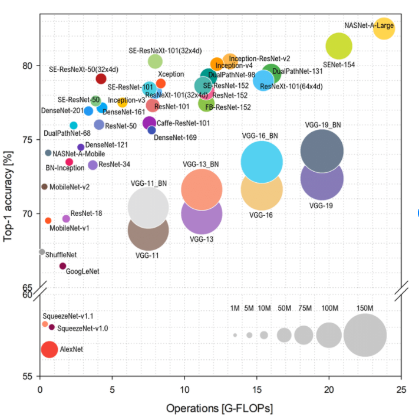

  - 목적 : 더 깊은 네트워크(layer를 늘려 정확도 상승) & 성능 향상 (파라미터 줄여 속도 상승)

  - AlexNet

    - 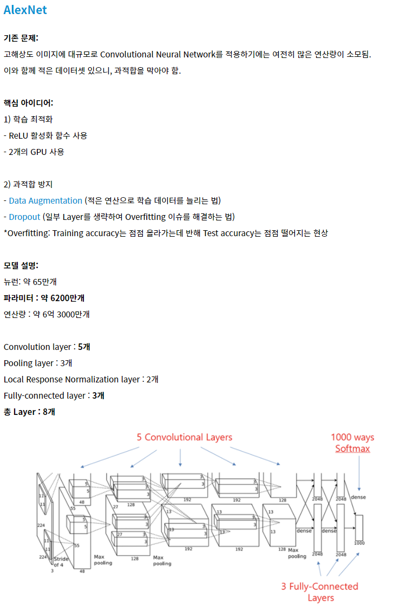

  - GoogLeNet

    - 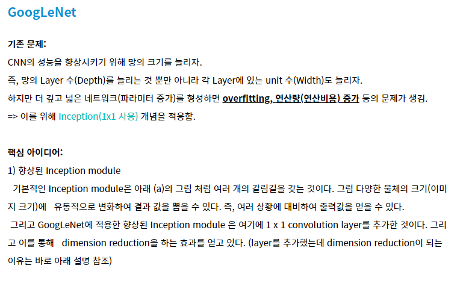
    - 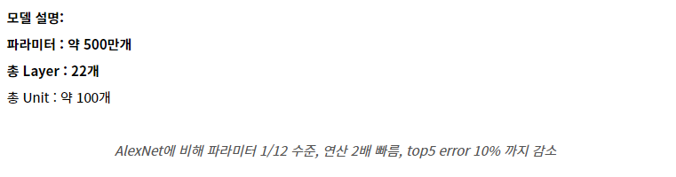

  - ResNet

    - 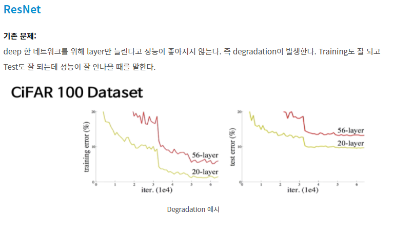
    - 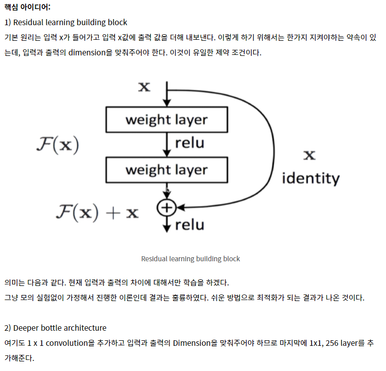
    - 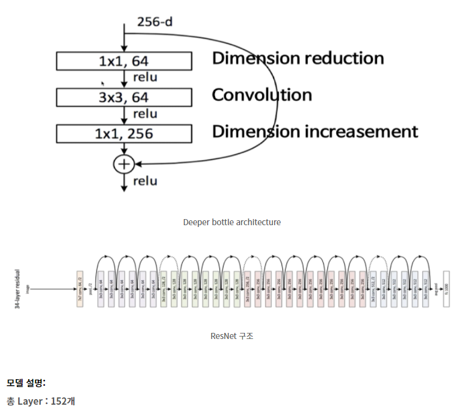

  - NASNet (Neural Architecture Search Network)

    신경 아키텍처 검색 네트워크(이미지 분류)

    - https://sh-tsang.medium.com/review-nasnet-neural-architecture-search-network-image-classification-23139ea0425d

  - MobileNet

    - 17년에 발표한 모델로써 Teachable Machine에 구현되어 일반 사용자가 쉽게 접할수 있는 인공지능 모델로 서비스되고 있다.
    - https://sotudy.tistory.com/15  - v2 (2017)
    - https://deep-learning-study.tistory.com/551 - v3 (2019)

##### 2. RNN (순환 신경망)

- 규칙적 패턴 인식, 정보추출

- 앞선 데이터를 토대로 값 누적

- 특징

  - 텍스트, 음악, 영상등 순차적 데이터에 이용

  - 베니싱 그레디언트 문제발생가능 (기울기 소실)

    - 활성함수 = 비선형함수(ex : ReLu) 선택으로 해결
    - LSTM으로 해결

  - #### 과거 데이터 이용, 다음을 추론함

##### 3. GAN (생성 대립 신경망)

- 비지도 학습

- 이미지나 음성을 새로 생성함 ex) 딥페이크

- 이미지 및 음성 복원에 이용

- DCGAN 은 개선된 GAN이다.

  - #### 새로운 데이터를 창조해 내는 것

##### 4. RL (강화학습)

- 구글 딥마인드에서 개발 , 관개형 추론

- 입력 데이터 간의 관계성을 추론함

- 인간의 사고에 근사한 논리적 추론이 가능하게함

  - #### 정해진 규칙이 없는 관계를 추론

##### 5. Transformer 

- rnn의 느린 현상을 해결하기 위해 나옴
- seq2seq모델의 한계를 탈피하기 위해 나옴 (인코더와 디코더를 이용한 것임)
  - 즉 깊어질 수록 초기값이 사라지는 것을 방지하기 위해 나온 어텐션을   rnn의 보정용도가 아닌 인코더와 디코더로 만든 것.
- https://moondol-ai.tistory.com/460

##### 6. bert  <= 언어 특화모델

출처 - https://rubber-tree.tistory.com/115

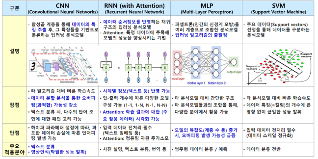

https://halfundecided.medium.com/%EB%94%A5%EB%9F%AC%EB%8B%9D-%EB%A8%B8%EC%8B%A0%EB%9F%AC%EB%8B%9D-cnn-convolutional-neural-networks-%EC%89%BD%EA%B2%8C-%EC%9D%B4%ED%95%B4%ED%95%98%EA%B8%B0-836869f88375

#### 2. 딥러닝 프레임워크

1. 텐서플로(tensorflow)

   1. 특징 : 구글에서 만든 오픈소스 소프트웨어 라이브러리이며 데이터 플로우 그래프 구조를 사용한다. 

      1. 데이터 플로우 그래프 구조 : 데이터의 흐름을 노드와 엣지를 사용한 방향성 그래프로 표현하는 방식 

         노드 사이의 연결이나 다차원 배열등을 의미하는 텐서 사이의 연결관계를 표현할 수 있다.

   2. 장점 : 이미지 인식, 반복 신경망, 기계 번역, 필기 숫자판별에 사용

      대규모 예측 모델 구성에 뛰어남.  

      구글에서 전폭적인 지원, 지속적인 성능 개선과 빠르고 안정적.

      추상화 수준이 높아 알고리즘의 세세한 구현 << 전체적인 논리

      확장성이 뛰어남

   3. 단점 : 모델의 기초 레벨부터 작업해야해서 초보자가 어려울 수 있다. 유기적인 신경망을 만들 수 없어 성능의 한계를 가지고 있다.

2. 케라스(keras) 

   1. 특징 : 텐서플로의 문제를 해결하기 위하여 단순화된 인터페이스를 제공함. 시퀀스 모델로 원하는 레이어를 쉽게 순차적으로 쌓을 수 있다. 다중 출력 등 복잡한 모델 구성시 케라스 함수 API를 사용하여 쉽게 구성 가능함. 
   2. 장점 : 일반 사용 사례에 최적화된 간단하고 일관 된 인터페이스를 제공. 사용자 오류에 대해 명확하고 실용적인 피드백을 제공함. 케라스의 구성 요소는 모듈 형태로, 각 모듈이 독립성을 갖기 때문에 새로운 모델을 만들 때 각 모듈을 조합해 쉽게 새로운 모델을 만들 수 있다.
   3. 단점 : 모듈화의 한계로 복잡한 프로젝트에 구현이 어려움. 다양한 백엔드 위에 동작하기 때문에 오류 발생시 디버깅이 어려움

3. 파이토치(pytorch)

   1.  특징 : 페이스북 AI연구팀이 개발한 파이썬 기반 오픈소스 머신러닝 라이브러리. 텐서플로보다 절차가 간단하고 그래프가 동적으로 변화가능하며 파이썬과 유사하다.
   2.  장점 : 그래프를 만들면서 동시에 값을 할당하는 방식으로 코드가 깔끔하고 직관적이다. 학습속도가 빠르다.  메모리에서 연산을 하며 신경망 사이즈를 최적으로 바꾸면서 동작이 가능하다. Numpy를 대체하면서 GPU를 이용한 연산이 가능하며 유연하고 빠르다.
   3.  단점 : 텐서플로에 비해 사용자층이 낮고 학습에 필요한 자료와 예제를 구하기 쉽지 않음

   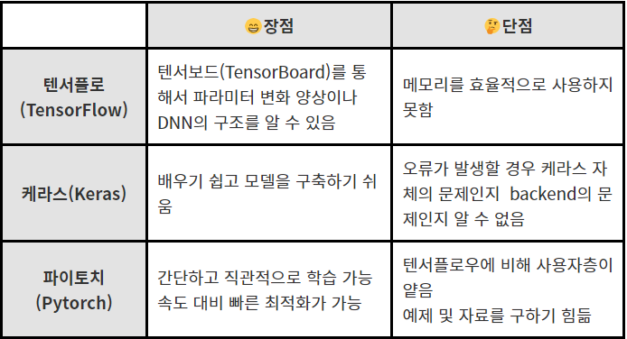

[출처 : https://hongong.hanbit.co.kr/%EB%94%A5%EB%9F%AC%EB%8B%9D-%ED%94%84%EB%A0%88%EC%9E%84%EC%9B%8C%ED%81%AC-%EB%B9%84%EA%B5%90-%ED%85%90%EC%84%9C%ED%94%8C%EB%A1%9C-%EC%BC%80%EB%9D%BC%EC%8A%A4-%ED%8C%8C%EC%9D%B4%ED%86%A0%EC%B9%98/]()

데이터 

- 딥러닝은 데이터를 통해 예측 혹은 판별의 역할을 수행한다. 
- 라밸링의 여부에 따라 '지도학습'과 '비지도학습' 으로 나뉜다
  - 지도학습 : 데이터에 대한 분류(라벨)이 되어있는 대부분이 경우 < 지도학습으로 진행하였음
  - 비지도 학습 : ex) GAN과 오토인코더

#### 3. 전이 학습이란

정교한 딥 러닝 모델에는 수백만 개의 매개변수(가중치)가 있으며 이를 처음부터 훈련하려면 종종 많은 양의 컴퓨팅 리소스 데이터가 필요합니다. 전이 학습은 관련 작업에 대해 이미 훈련된 모델의 일부를 가져와 새 모델에서 재사용함으로써 손쉽게 데이터를 구축하는 기술입니다.

예를 들어, 이 섹션의 다음 튜토리얼에서는 이미지 내에서 수천 가지의 다양한 객체를 인식하도록 이미 훈련된 모델을 활용하여 고유한 이미지 인식기를 구축하는 방법을 보여줍니다. 사전에 훈련된 모델의 기존 지식을 조정함으로 필요한 원래 모델보다 훨씬 적은 훈련 데이터를 사용하여 자체 이미지 클래스를 감지할 수 있습니다.

이 방법은 새 모델을 신속하게 개발하고 브라우저 및 모바일 장치와 같이 리소스가 제한된 환경에서 모델을 사용자 정의하는 데 유용합니다.

대부분은 전이 학습을 할 때 원래 모델의 가중치를 조정하지 않습니다. 대신 최종 레이어를 제거하고 잘린 모델의 출력 위에 새로운(종종 상당히 얕은) 모델을 훈련합니다. 이러한 기술은 해당 섹션 튜토리얼에 잘 나타나 있습니다.

- https://www.tensorflow.org/js/tutorials/transfer/what_is_transfer_learning?hl=ko


### 3. 코딩

- ResNet50에 대한 논문을 가지고 직접 레이어를 구현해봄.

- 인터넷 검색을 이용한 예제들과 비교함

- 예제들을 따라 쳐보며 학습을 진행함

- 단순한 고양이 & 강아지 분류 모델을 응용하여 직접 구현한 모델에 학습을 진행해봄

- 약 85%정도의 acc값을 확인 후 직접 수집한 사진데이터를 넣어 학습시킴

- 40%대의 저조한 학습률이 도출됨.

- 더 나은 모델을 구현하기 위해 "전이학습"방법을 알게됨

- tensorflow hub에서 학습되고 수정가능한 모델을 가져와 사용하는 것으로 결정

- 수정가능한 모델들이 대부분 MobileNet 기반의 모델이다.

  

```python
# 학습을 시키는데 필요한 라이브러리들을 가져온다.

import os
import zipfile
import matplotlib.pylab as plt
import tensorflow_hub as hub
from tensorflow.keras import layers
import time, random, datetime
import numpy as np
import tensorflow as tf
```

```python
# 기본 경로
base_dir = './base_total'
# 학습 데이터
train_dir = base_dir + '/train'
# 테스트 데이터
test_dir = base_dir + '/test'
```

```python
#학습 데이터의 증폭을 해준다.
train_generator = tf.keras.preprocessing.image.ImageDataGenerator(rescale=1/255,
                                                                 rotation_range = 40,
                                                                 width_shift_range=0.2,
                                                                 height_shift_range=0.2,
                                                                 shear_range=0.2,
                                                                 zoom_range=0.2)
#테스트 데이터는 증폭을 하지 않는다.
image_generator = tf.keras.preprocessing.image.ImageDataGenerator(rescale=1/255)
#학습과 테스트 데이터를 인공지능에 넣을 수 있도록 해주며 클래스를 파악하도록한다.
train_data = train_generator.flow_from_directory(train_dir,batch_size=32, target_size=(224, 224))
test_data = image_generator.flow_from_directory(test_dir,batch_size=32, target_size=(224, 224))
```

학습셋 6000개 3개의 분류(동작), 테스트셋 240개 3개의 분류

Found 5979 images belonging to 3 classes.
Found 240 images belonging to 3 classes.

```python
#학습셋 확인
for train_batch, label_batch in train_data:
  print("Image batch shape: ", train_batch.shape)
  print("Label batch shape: ", label_batch.shape)
  break
```

Image batch shape:  (32, 224, 224, 3)
Label batch shape:  (32, 3)

```python
#테스트셋 확인
for test_batch, label_batch in test_data:
  print("Image batch shape: ", test_batch.shape)
  print("Label batch shape: ", label_batch.shape)
  break
```

Image batch shape:  (32, 224, 224, 3)
Label batch shape:  (32, 3)

```python
# tensorflowhub에서 학습이 되어있는 모델을 가져온다
# 전이학습을 통해 학습을 시키는 것.
feature_extractor_url = "https://tfhub.dev/google/tf2-preview/mobilenet_v2/feature_vector/4"

#입력 방식을 결정
feature_extractor_layer = hub.KerasLayer(feature_extractor_url,
                                         input_shape=(224,224,3))
feature_batch = feature_extractor_layer(train_batch)
feature_extractor_layer.trainable = False
```

```python
#GPU를 사용해서 학습을 한다.
with tf.device("/gpu:0"):
    model = tf.keras.Sequential([
      feature_extractor_layer,
      layers.Dense(train_data.num_classes, activation='softmax')
    ])
```

```python
#HUB에서 가져온 모델에 프로잭트에서 요구하는 DENSE를 붙인다.
model.summary()

Model: "sequential"
_________________________________________________________________
Layer (type)                 Output Shape              Param #   
=================================================================
keras_layer (KerasLayer)     (None, 1280)              2257984   
_________________________________________________________________
dense (Dense)                (None, 3)                 3843      
=================================================================
Total params: 2,261,827
Trainable params: 3,843
Non-trainable params: 2,257,984
_________________________________________________________________
```

```python
#활성함수와 학습 시 출력할 것, LOSS를 이용하는 방법등을 결정한다.
model.compile(
  optimizer=tf.keras.optimizers.Adam(),
  loss='categorical_crossentropy',
  metrics=['acc',
          tf.keras.metrics.Precision(name='precision'),
           tf.keras.metrics.Recall(name='recall')])
```

```python
#GPU이용 확인.
from tensorflow.python.client import device_lib
device_lib.list_local_devices()
```

[name: "/device:CPU:0"
 device_type: "CPU"
 memory_limit: 268435456
 locality {
 }
 incarnation: 11923327532854437206,
 name: "/device:GPU:0"
 device_type: "GPU"
 memory_limit: 31589217152
 locality {
   bus_id: 1
   links {
   }
 }
 incarnation: 14079714312639032009
 physical_device_desc: "device: 0, name: Tesla V100S-PCIE-32GB, pci bus id: 0000:03:00.0, compute capability: 7.0"]

```python
#EPOCH등을 결정한다.(학습셋과 테스트셋의 크기의 변동에 따라 변화하도록 해준다.)
steps_per_epoch = np.ceil(train_data.samples/train_data.batch_size)
steps_test_per_epoch = np.ceil(test_data.samples/test_data.batch_size)

#학습을 진행한다.
history = model.fit(train_data,
                    validation_data=test_data,
                    steps_per_epoch=steps_per_epoch,
                    epochs=15,
                    validation_steps=steps_test_per_epoch,
                    verbose=2)
```

```python
#학습 진행과정.  학습셋에 대한 각종 지표와 테스트셋에 대한 지표를 확인하여 F1스코어를 산출할 수 있다.
Epoch 1/15
187/187 - 835s - loss: 0.8901 - acc: 0.5964 - precision: 0.6802 - recall: 0.4568 - val_loss: 0.7634 - val_acc: 0.7125 - val_precision: 0.7754 - val_recall: 0.6042
Epoch 2/15
187/187 - 820s - loss: 0.6121 - acc: 0.7642 - precision: 0.8184 - recall: 0.6770 - val_loss: 0.6361 - val_acc: 0.7833 - val_precision: 0.8177 - val_recall: 0.6917
Epoch 3/15
187/187 - 815s - loss: 0.5282 - acc: 0.7913 - precision: 0.8307 - recall: 0.7314 - val_loss: 0.5716 - val_acc: 0.7958 - val_precision: 0.8381 - val_recall: 0.7333
Epoch 4/15
187/187 - 817s - loss: 0.4858 - acc: 0.8127 - precision: 0.8480 - recall: 0.7679 - val_loss: 0.5250 - val_acc: 0.7875 - val_precision: 0.8318 - val_recall: 0.7417
 - - -
```

```python
#그래프로 볼 수 있도록 시각화해준다.
import matplotlib.pyplot as plt

acc = history.history['acc']
val_acc = history.history['val_acc']
loss = history.history['loss']
val_loss = history.history['val_loss']

epochs = range(len(acc))

plt.plot(epochs, acc, 'bo', label='Training accuracy')
plt.plot(epochs, val_acc, 'b', label='Validation accuracy')
plt.title('Training and validation accuracy')
plt.legend()

plt.figure()

plt.plot(epochs, loss, 'go', label='Training Loss')
plt.plot(epochs, val_loss, 'g', label='Validation Loss')
plt.title('Training and validation loss')
plt.legend()

plt.show()
```

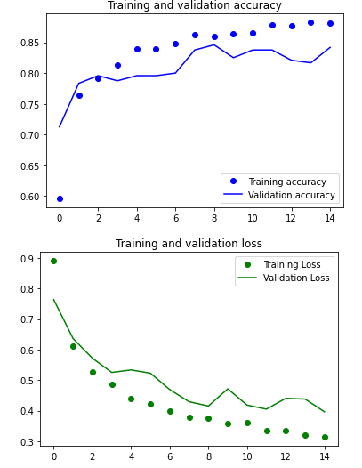

```python
#학습한 모델을 저장하는것.
export_path = "MobileNet total v4"
model.save(export_path, save_format='tf')
```

```python
#path에 원하는 동작을 찍은 사진을 선택해서 학습한 모델에 넣어서 결과값을 확인한다.
path='./2.PNG'
img=image.load_img(path, target_size=(224, 224))

x=image.img_to_array(img)
x=np.expand_dims(x, axis=0)
images = np.vstack([x])

classes = model.predict(images, batch_size=32)

print(classes)
```

3개의 클래스중 3번째 클래스가 77%확률로 정답일 것으로 추측한다.

[[0.10649943 0.11844391 0.77505666]]

ex)


## 4. Teachable Machine을 이용한 모델 제작

#### 1. 데이터 수집

1) 아무것도 없는 사진

2) 검출하고 싶은 동작

3) 그외 다른동작 (검출하고 싶은 동작으로 값이 튈 수 있으니 넣어준다.)

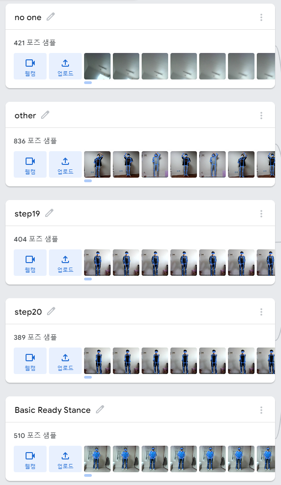

#### 2. 학습변수 수정하여 학습

데이터 셋을 150번 학습 시키며 배치크기를 32로 설정한다. 이는 인공지능 논문중에서 현재 구현된 이론에서 배치크기는 최대 32혹은 64정도가 값이 제일 잘나온다라는 것을 알게되어서 32로 설정하였다.

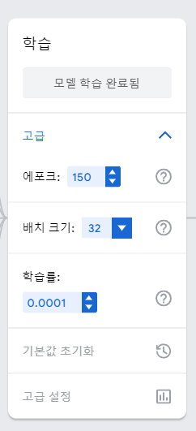

#### 3. 학습된 모델 검증 

해당 동작을 하였을 때 그 동작으로 %가 올라가는지 확인 후 모든 동작을 제대로 검출하면 성공, 실패하면 처음부터 다시 진행한다.

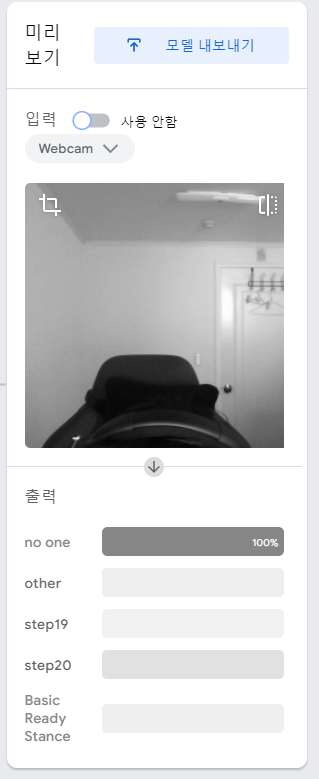


## 5. 최종 결과물

Teachable Machine을 사용하여 학습시킨 모델은 tensorflow.js버전으로 바로 웹에 적용할 수 있다.

기본동작별로 검출하지 못하는 동작을 제외한 7가지 모델, 태극 1,2,8장에 대한 연결동작, 겨루기 모델을 완성하였다.


각 자세에 대한 데이터 사진들과 추가 데이터들, 학습된 모델들을 zip파일로 정리한 것의 일부이다.


## 6. 이외 출처들

https://tykimos.github.io/2017/03/08/CNN_Getting_Started/

https://www.codeonweb.com/entry/eda18bec-7c7d-426f-ab98-90e18db6fdba

https://3months.tistory.com/199

https://wiserloner.tistory.com/1219?category=837669

https://ysyblog.tistory.com/152

https://skk095.tistory.com/30