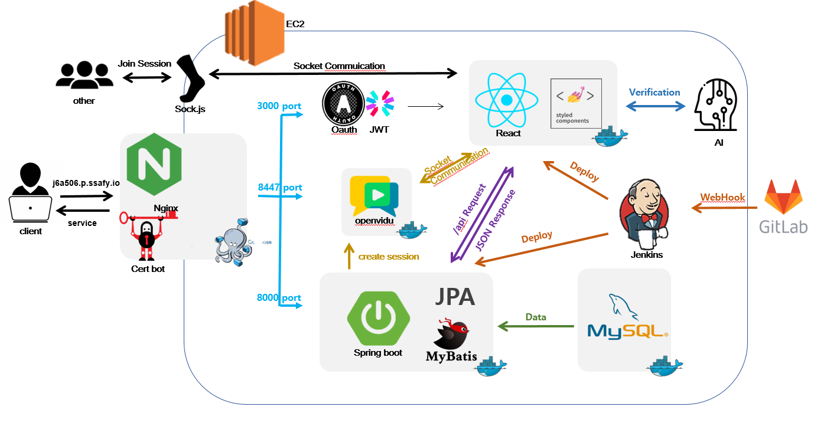

  
   

  # 검은띠 휘날리며

## 소개

> 우리문화 `태권도`를 세계에 홍보하기 위한 웹 기반 `AI 체험형 콘텐츠` 서비스, `Black Belt: Master of Taekwondo`
>  

집에서 쉽고 재미있게 태권도를 학습해보세요! AI pose detection 기술로 자연스럽게 올바른 태권도 동작을 따라하도록 유도합니다.    
충분한 연습 후에는, 국기원과 동일한 방식으로 심사를 받아 단증을 획득할 수 있습니다. 
겨루기로 원하는 상대와 1:1 배틀을 벌여 실력을 가릴 수도 있습니다.  
태권도 짱이 되고 싶다면 BlackBelt로 수련을 시작하세요!    

 

## 목차

 

## 개요  
* 프로젝트명: 검은띠 휘날리며 [Black Belt: Master of Taekwondo]
* 서비스 특징: AI 모션인식을 통한 태권도 학습 web service
* 주요 기능
  - 태권도 동작 학습 모델 기반 태권도 연습 및 심사
  - WebSocket을 통한 겨루기 매칭
  - WebRtc기술을 활용한 겨루기 화면
* 주요 기술
  - React
  - REST API
  - Node.js
  - MySQL
  - AWS EC2 + NGINX
  - Docker + Jenkins
* 참조 리소스
  - openvidu - webRtc
* 배포 환경
  - URL: https://j6a506.p.ssafy.io/

 

## 주요 기능

### 🥋 번역 기능 제공

  

  

   

- 글로벌 서비스를 지향하는 저희 블랙벨트는, 번역 서비스를 제공합니다
- 네비게이션바에서 언제든지 원하는 언어로 편하게 바꾸어보실 수 있습니다

 

### 🥋 메인페이지

     

- 연습모드, 심사모드, 겨루기로 나뉘어져 있습니다
- 태권도 영상을 배경으로 두어 웅장함을 더했습니다

 

### 🥋 연습모드

**1. 기본동작**

   

- 태권도의 7가지 기본동작들을 학습합니다
- 레벨에 따라 스테이지의 잠금이 해제됩니다
- 해당 스테이지를 클리어 하면 정확도에 따라 별을 1개부터 3개까지 얻을 수 있습니다
- 동작 카드 위에 마우스를 올려 동작에 대한 간단한 설명을 확인할 수 있습니다
- 자세한 설명은, 카드를 클릭시 연습 화면에서 확인할 수 있습니다

 

**2. 연결동작 & 품새** 

  

- 하나의 품새를 4단락으로 나누어 연습할 수 있도록 `연결동작` 코너를 만들었습니다
- 연결동작을 정확히 익힌 후 품새를 연습해보세요!
- 카드를 눌러 연습 스테이지로 입장하면, 상단에 동작 순서가 명시됩니다
- 명시된 동작을 정확하게 취하면 다음 동작으로 넘어갈 수 있습니다

 

### 🥋 겨루기

    

- 겨루기 일반모드에서는 원하는 사용자를 지정해 겨루어볼 수 있습니다
- 상대의 닉네임을 검색하고 겨루기 신청을 보내보세요!

- 단, 상대가 다른 사람과 겨루기중이거나 로그아웃이거나 혹은 심사중인 경우, 겨루기 신청을 보낼 수 없습니다
- 유저의 상태는 닉네임 검색을 하면 이름 바로 아래에 나타납니다
- 상대가 겨루기 신청을 수락하면, 페이지에 상대의 정보가 나타나고 겨루기 시작 버튼이 활성화됩니다
- `겨루기 시작` 버튼을 눌러 겨루기를 시작해봅시다!

- 상대방에 대한 예의를 갖추고 `태권도 기본 준비동작`을 취하면, 인공지능이 이를 인식하고 겨루기가 시작됩니다
- 방어 동작을 성공하면 상단에 노란색 방패 이모티콘이 나타나며, 공격을 성공하면 상대에게 데미지 이펙트가 들어갑니다
- 30초 동안 상대의 공격을 막거나, 공격을 하면서 열심히 겨루어봅시다!

 

### 🥋 마이페이지

      

- 내 정보를 한눈에 확인할 수 있는 마이페이지입니다
- 지금까지 획득한 띠 및 단증을 확인할 수 있으며 겨루기와 관련된 전적을 확인할 수 있습니다
- 프로필사진 변경 및 닉네임 변경도 가능합니다

 

## 기술 스택

### 🎨 Front-end

# 프로젝트 상세 설명

## 1. 프론트

# 서비스 소개  
### a) 메인페이지

## 2. 백엔드
### 웹소켓

### 개요

1:1 배틀 [겨루기] 기능에서

client-client 간 양방향 통신을 구현하기 위해 웹소켓 통신을 사용함.

[ SockJs + STOMP ]

### 기술스택 선정이유

- Polling / Long Polling / SSE 방식을 고려했지만  ‘대용량, 실시간, 단기’ 통신인 우리 서비스와 맞지않아 기각
- 웹소켓 라이브러리 [socket.io/](http://socket.io/) sockJs 등 중 Spring Framework 에서 더 안정적인 sockJs 라이브러리 선택
- 통신규약을 위해 메시징 프로토콜 STOMP 사용

### WebSocket

- 서버↔클라이언트 간 양방향통신 가능
- HTTP 환경에서 사용가능한 TCP 연결방식
- HTML5 표준 (브라우저 별 지원현황 확인)

### STOMP

- Frame 기반 프로토콜
- MessageBroker 인터페이스 사용
- Sub/ Pub 구조

  

### 동작방식

1. Nginx 경로설정
    1.  http→ws 통신 헤더 요청으로 프로토콜 upgrade

  

1. Server측 endpoiont 설정
2. Client 측 지정 endpoint로 socket 객체생성
3. Server 측 수신한 데이터 재발행하는 메서드 작성
4. Client 소켓데이터 send, receive

### Endpoint 경로

[https://j6a506.p.ssafy.io/stomp/](https://j6a506.p.ssafy.io/stomp/)  

### WS API

| 기능 | 프로토콜 | 동작 | api | 메시지 Type |
| --- | --- | --- | --- | --- |
| 개인세션 생성 | ws | sub | api/que/user | LOGIN |
| 겨루기 신청 | ws | pub | api/que/user/{게스트 id} | INVITE |
| 신청 수락/거절 | ws | pub | api/que/user/{호스트 id} | ACCEPT/REFUSE |
| 대기방 입장 | ws | pub | api/que/user/{호스트 id} | ENTER |

 

### [지정큐] 시퀀스 다이어그램

## 3. 서버
 #### 1. 서버 접속 정보

> server ip : j6a506.p.ssafy.io  
> client id : ubuntu  
> client pw : pem파일로 대체 (MM첨부파일 확인, 팀원 이외에 공유 금지)

 

- 서버에서 사용하는 브랜치는 develop 브랜치 이용
  - 서버에 변경사항 적용시 작업한 브랜치 develop에 merge한 뒤 pull하여 적용 확인

#### 2. 포트 정보

| 포트 번호 |                   이름                    |
| :-------: | :---------------------------------------: |
|    22     |                    SSH                    |
|    53     |                    DNS                    |
|    80     | Redirected to Port 443 by nginx (docker)  |
|    443    | Redirected to Port 3000 by nginx (docker) |
|   3000    |             Frontend (Docker)             |
|   5050    |              MySQL (Docker)               |
|   8000    |             Backend (Docker)              |
|   8080    |         Jenkins Controller Web UI         |
|   8447    |      openvidu server https (Docker)       |
|   8448    |       openvidu server http (Docker)       |
|   8888    |       kurento media server (Docker)       |
|   8888    |        jupyter notebook (비활성화)        |
|   50000   | Jenkins TCP Agent Listener Port (Docker)  |

#### 3. 아키텍처 구성도

 

 

#### 4. 서버 설계 상세내용

- 주피터 접속 정보 및 상세 설명 - > server ip : j6a506.p.ssafy.io:8888
   설명 : https로 하기위해 사설 cert 키로 진행해서 크롬에서 안전하지 못한 페이지로 인식합니다.

  - 노션 - [주피터 노트북 설치과정 보기](https://half-leather-4d3.notion.site/d066fbefa6c44f8ba407f4c77b1cf7d1)

- 도커 및 도커 컴포즈 설치
  - 노션 - [도커 설치과정 보기](https://half-leather-4d3.notion.site/4fcf091259e14df5bf60c13e837bf79d)

- 젠킨스 활용
  - 노션 - [젠킨스 깃 연동 자동 빌드/배포 보기](https://half-leather-4d3.notion.site/ce92c2f95e044c3b98cdd370b6c48bdc)

- NGINX & CERTBOT
  - 노션 - [엔진엑스 세팅 및 프록시 설정 보기](https://half-leather-4d3.notion.site/NGINX-CERTBOT-5271e86c1e9b4fe086c90c1eac482d66)

- 서버 mysql 세팅
  - 노션 - [서버 mysql 세팅 과정 보기](https://half-leather-4d3.notion.site/mysql-f55c1ba091be4573aeb044e6b3f52517)

- 프론트 / 백 도커
  - 노션 - [프론트 / 백 도커파일 보기](https://half-leather-4d3.notion.site/44e6651adb73413aba23f0fd6fa795a9)

## 4. AI
### 프로젝트 요구사항

1. 기본동작 - 13가지 기본동작을 판단해주는 인공지능 모델
2. 연속동작/품새 - 1장~8장, 고려, 금강 등 품새별 4개의 구간으로 나눠서 해당 구간의 동작을 구분하는 인공지능 모델
3. 겨루기 - 얼굴막기, 몸통지르기, 발차기 등의 동작을 구분하는 인공지능 모델

### 인공지능 제작 (진행과정)

1. 인공지능 기본이론 학습
2. CNN, RNN등 모델의 이론적 학습 및 선정
3. 머신러닝 코딩 예제 학습
4. ResNet50 논문 구현 및 학습
5. 고양이&강아지 데이터 분류 예제 학습 및 구현한 모델 적용학습
6. 프로젝트에 맞는 데이터 수집(동작별 사진 촬영)
7. 데이터 전처리(이상하게 나온 사진 제거)
8. 구현한 모델에 데이터 입력하여 학습
9. 학습된 모델 검증 => 40%대 정확도나옴
10. 전이학습으로 변경
11. 데이터에 스켈레톤을 그리는 것으로 전처리작업을 진행함
12. 정확성과  f1스코어가 준수하게 나옴에도 불구하고 실제 동영상의 프레임으로 된 사진을 넣을 경우 정확도가 매우 낮아짐.
13. 전이학습에 사용되는모델 MobileNet V2 => MobileNet V3로 변경함
14. 모델 학습
15. 80%대 정확도가 나옴. 테스트셋과 비교, f1 스코어를 통해 오버피팅 언더피팅확인.
16. 실제 검증을 하였을 때 오차가 매우 심하게 나옴
17. 개선할 시간이 없는 것을 인지하여 Teachable Machine으로 변경
18. 데이터 수집과 정제하여 학습
19. 각 클래스가 정확하게 나오는지 검증.
20. 프론트 엔드에게 전달.
21. 모든 요구사항에 대하여 반복작업 진행.

## 0️⃣ Members

<table>
  <thead>
  	<tr>
      <td align="center">
        
        

           
          <b>연승은</b>
           
          Frontend | Leader | Design
        

      </td>
      <td align="center">
      	
        

           
          <b>정지영</b>
           
          Frontend | Design
        

      </td>
      <td align="center">
      	
        

           
          <b>최영운</b>
           
          AI
        

      </td>
    </tr>
  </thead>
  <tbody>
  	<tr>
    	<td>
        <ul>
          <li>추가예정</li>
          <li>추가예정</li>
          <li>추가예정</li>
        </ul>
      </td>
      <td>
        <ul>
          <li>추가예정</li>
          <li>추가예정</li>
          <li>추가예정</li>
        </ul>
      </td>
      <td>
        <ul>
          <li>추가예정</li>
          <li>추가예정</li>
          <li>추가예정</li>
        </ul>
      </td>
    </tr>
  </tbody>
</table>

<table>
  <thead>
  	<tr>
      <td align="center">
        
        

           
          <b>이지우</b>
           
          Backend | CI/CD
        

      </td>
      <td align="center">
      	
        

           
          <b>임영택</b>
           
          Backend
        

      </td>
      <td align="center">
      	
        

           
          <b>최윤수</b>
           
          Backend
        

      </td>
    </tr>
  </thead>
  <tbody>
  	<tr>
    	<td>
        <ul>
          <li>추가예정</li>
          <li>추가예정</li>
          <li>추가예정</li>
        </ul>
      </td>
      <td>
        <ul>
          <li>추가예정</li>
          <li>추가예정</li>
          <li>추가예정</li>
        </ul>
      </td>
      <td>
        <ul>
          <li>추가예정</li>
          <li>추가예정</li>
          <li>추가예정</li>
        </ul>
      </td>
    </tr>
  </tbody>
</table>

